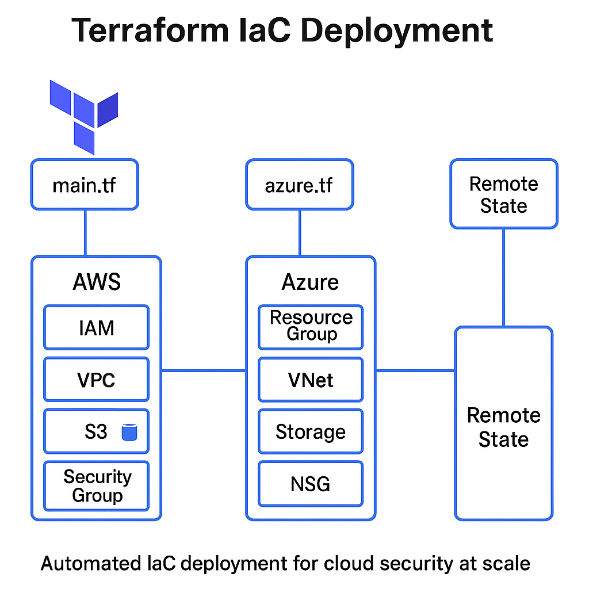

## Terraform IaC: Multi-Cloud, Multi-Region, Modules and Policy-as-Code

Automating secure infrastructure provisioning on AWS and Azure using Terraform, with modular code structure and remote state management via S3 and Azure Blob Storage.  
Includes advanced Infrastructure as Code techniques including multi-region resource deployment using provider aliases, scalable infrastructure with registry modules and Policy-as-Code enforcement with OPA/Conftest.

---

## Table of Contents

- [Overview](#overview)
- [Real-World Risk](#real-world-risk)
- [What I Built](#what-i-built)
- [Diagram](#diagram)
- [Objectives](#objectives)
- [Steps Performed](#steps-performed)
  - [1. Project Setup]
  - [2. AWS Infrastructure Deployment]
  - [3. Azure Infrastructure Deployment]
  - [4. Remote State for AWS]
  - [5. Remote State for Azure]
  - [6. Validation in Cloud Consoles]
  - [7. State Secured Remotely]
  - [8. Infrastructure Destroyed]
  - [9. Cleanup]
- [Screenshots](#screenshots)
- [Advanced Terraform Features Bonus](#advanced-terraform-features-bonus)
  - [1. Multi-Region AWS S3 Buckets with Provider Aliases] 
  - [2. Reusable Terraform Registry Module (S3)]
  - [3. Policy-as-Code with OPA and Conftes]
- [Lessons Learned](#lessons-learned)
- [Notes and Limitations](#notes-and-limitations)
- [References](#references)
- [Contact](#contact)

---

## Overview

This lab demonstrates secure Infrastructure as Code (IaC) deployment using Terraform across both AWS and Azure. It includes modular provisioning of IAM, network and storage resources, as well as best practices such as versioning, remote state and automated cleanup.

---

## Real-World Risk

Without secure and consistent infrastructure provisioning:
- Misconfigured IAM roles can expose sensitive data.
- Lack of versioning can lead to untraceable infrastructure changes.
- Local state files risk being corrupted, lost or leaked.

---

## What I Built

A fully automated, multi-cloud Terraform project that:
- Provisions secure infrastructure in AWS and Azure.
- Uses remote backends (S3, Azure Blob) to store Terraform state securely.
- Applies tagging, versioning and security group policies.
- Includes full lifecycle automation: init, plan, apply and destroy.

In addition to the core multi-cloud workflow, I implemented a bonus Terraform mini-lab demonstrating provider aliasing for multi-region AWS S3 deployment, usage of registry modules for scalable infrastructure and Policy-as-Code enforcement with OPA/Conftest.

---

## Diagram

---

## Objectives

- Create AWS and Azure infrastructure using Terraform.
- Structure modular IaC code for reuse.
- Secure state files using remote backends.
- Capture and document the full deployment lifecycle.
- Showcase advanced IaC skills including multi-region resource design, registry module reuse and automated security policy validation.

---

## Steps Performed

**1. Project Setup**
   - Created root folder and initialized `aws/`, `azure/`, `remote-state/` and `assets/` subfolders.
   - Installed Terraform, AWS CLI and Azure CLI *(Screenshot: `repo-structure.png`)*

**2. AWS Infrastructure Deployment**
   - Configured AWS provider.
   - Created IAM role, VPC, S3 bucket with versioning and Security Group for HTTP/SSH *(Screenshots: `main-tf-content.png`, `plan-output.png`, `apply-output.png`, `aws-vpc.png`, `aws-s3-bucket.png`, `aws-iam-role.png` & `aws-security-group.png`)*

**3. Azure Infrastructure Deployment**
   - Configured Azure provider using `az login`.
   - Created Resource Group, Virtual Network, Storage Account and NSG *(Screenshots: `main-tf-azure-code.png`, `plan-output-azure.png`, `apply-output-azure.png`, `azure-resource-group.png`, `azure-vnet.png`, `azure-nsg.png` & `azure-storage-account.png`)*

**4. Remote State for AWS**
   - Created S3 bucket `terraform-remote-state-lab` and DynamoDB table `terraform-lock-table`.
   - Connected backend to store Terraform state with locking *(Screenshots: `aws-remote-s3-bucket.png`, `aws-remote-dynamodb-table.png`, `aws-backend-config.png` & `aws-init-remote-backend.png`)*

**5. Remote State for Azure**
   - Created Azure Storage Account `terraformremotestate2025` and container `tfstate`.
   - Linked backend to secure `.tfstate` in Azure Blob *(Screenshots: `azure-storage-remote-account.png`, `azure-storage-container.png`, `azure-storage-access-keys.png`, `azure-backend-config.png` & `azure-init-remote-backend.png`)*

**6. Validation in Cloud Consoles**
   - Verified resources in both AWS and Azure portals *(Screenshots: `az-version-output.png` & `az-account-show.png`)*

**7. State Secured Remotely**
   - Verified that local `terraform.tfstate` is no longer written locally.
   - Observed versioning and locking behavior in AWS/Azure consoles.

**8. Infrastructure Destroyed**
   - Ran `terraform destroy` in both environments to clean up resources *(Screenshots: `destroy-output.png` & `destroy-output-azure.png`)*

**9. Cleanup**
   - In addition, remote state backends were manually deleted from:
     - **AWS**: S3 bucket + DynamoDB table.
     - **Azure**: Storage account + container + resource group.
   - Local `.terraform`, `.tfstate` and lock files were removed from each working directory.

---

## Screenshots

*All screenshots are included in the `screenshots/` folder.*

- **Core Screenshots Table**

| Step |            Filename              | Description                        |
|------|----------------------------------|------------------------------------|
| 1    | repo-structure.png               | Project folder and module layout   |
| 2    | main-tf-content.png              | AWS Terraform code                 |
| 2    | plan-output.png                  | Terraform plan for AWS             |
| 2    | apply-output.png                 | AWS apply output                   |
| 2    | aws-vpc.png                      | VPC resource created               |
| 2    | aws-s3-bucket.png                | S3 with versioning                 |
| 2    | aws-iam-role.png                 | IAM role created                   |
| 2    | aws-security-group.png           | Security group with HTTP/SSH rules |
| 3    | main-tf-azure-code.png           | Azure Terraform code               |
| 3    | plan-output-azure.png            | Azure plan output                  |
| 3    | apply-output-azure.png           | Azure apply output                 |
| 3    | azure-resource-group.png         | RG creation confirmed              |
| 3    | azure-vnet.png                   | Virtual Network created            |
| 3    | azure-nsg.png                    | NSG with rule                      |
| 3    | azure-storage-account.png        | Storage account created            |
| 4    | aws-remote-s3-bucket.png         | AWS S3 backend bucket              |
| 4    | aws-remote-dynamodb-table.png    | DynamoDB lock table                |
| 4    | aws-backend-config.png           | AWS backend config file            |
| 4    | aws-init-remote-backend.png      | Terraform init with AWS backend    |
| 5    | azure-storage-remote-account.png | Azure remote backend account       |
| 5    | azure-storage-container.png      | `tfstate` container                |
| 5    | azure-storage-access-keys.png    | Access key used for backend        |
| 5    | azure-backend-config.png         | Azure backend config file          |
| 5    | azure-init-remote-backend.png    | Terraform init with Azure backend  |
| 6    | az-account-show.png              | Azure login + subscription ID      |
| 6    | az-version-output.png            | Azure CLI version validated        |
| 8    | destroy-output.png               | AWS destroy output                 |
| 8    | destroy-output-azure.png         | Azure destroy output               |

- **Bonus Screenshots Table**

| Step             | Screenshot Filename        | Description                                |
| ---------------- | -------------------------- | ------------------------------------------ |
| Provider Aliases | providers-main-scripts.png | AWS provider aliases & S3 code             |
| Registry Module  | registry-module-script.png | Registry S3 module code                    |
| Registry Module  | module-apply-output.png    | Module apply output in Terraform           |
| OPA Policy       | opa-policy-script.png      | Example OPA/Rego policy for S3 encryption  |
| OPA Test Output  | confest-fail-output.png    | Conftest output showing a policy violation |

---

## Advanced Features: Bonus Terraform IaC Mini-Lab

This advanced section demonstrates practical IaC skills for production environments: multi-region AWS deployment, module reuse and Policy-as-Code validation.

**1. Multi-Region AWS S3 Buckets with Provider Aliases**  
   - Configured two AWS provider aliases for `us-east-1` and `us-west-1`.
   - Provisioned identical S3 buckets in both regions for high availability and disaster recovery *(Screenshot: `providers-main-scripts.png`)*

**2. Reusable Terraform Registry Module (S3)**  
   - Used the official [terraform-aws-modules/s3-bucket](https://registry.terraform.io/modules/terraform-aws-modules/s3-bucket/aws/latest) for scalable S3 provisioning.
   - Set minimal required variables (unique name, tags)
   - Applied the plan and verified resource creation *(Screenshots: `registry-module-script.png` & `module-apply-output.png`)*

**3. Policy-as-Code with OPA and Conftest**  
   - Authored a Rego policy to deny unencrypted S3 buckets.
   - Exported the Terraform plan to JSON.
   - Evaluated compliance with `conftest`, simulating CI/CD pipeline security checks *(Screenshots: `opa-policy-script.png` & `conftest-fail-output.png`)*

**S3 Security Best Practice:**Always block public access when creating S3 buckets via module:

  block_public_acls       = true
  block_public_policy     = true
  ignore_public_acls      = true
  restrict_public_buckets = true

---

## Lessons Learned

- How to use Terraform across AWS and Azure from a unified folder structure.
- Secure management of remote state with locking and versioning.
- Hands-on understanding of cloud-native IAM, networking, and storage.
- Importance of organizing infrastructure modules and outputs for reusability.
- Practical experience architecting for high availability with multi-region AWS resources and provider aliases.
- How to leverage and customize Terraform registry modules for rapid, secure infrastructure builds.
- How Policy-as-Code (OPA/Conftest) can enforce security/compliance before cloud resources are created.

---

## Notes & Limitations

- Resource names may need to be globally unique (e.g., Azure storage accounts).
- This lab uses default security settings; real-world production would enforce more restrictive IAM and NSG rules.
- Azure backend requires tenant/subscription ID via `az login`.
- OPA/Conftest integration may require additional setup on Windows environments due to UTF-16 vs. UTF-8 encoding issues with Terraform plan outputs.
- Some screenshots for policy testing may be simulated due to these encoding limitations, but the workflow and code remain fully valid for CI/CD and cloud-native teams.
- Multi-region deployments require globally unique resource names and may incur additional AWS costs.

---

## References

- [Terraform Docs – AWS Provider](https://registry.terraform.io/providers/hashicorp/aws/latest/docs)
- [Terraform Docs – Azure Provider](https://registry.terraform.io/providers/hashicorp/azurerm/latest/docs)
- [AWS CLI Installation](https://docs.aws.amazon.com/cli/latest/userguide/install-cliv2.html)
- [Azure CLI Installation](https://learn.microsoft.com/en-us/cli/azure/install-azure-cli)
- [Terraform Remote State](https://developer.hashicorp.com/terraform/language/state/remote)

---

## Contact

Sebastian Silva C. – August, 2025 – Berlin, Germany.
- [LinkedIn](https://www.linkedin.com/in/sebastiansilc/)
- [GitHub](https://github.com/SebaSilC)
- [sebastian@playbookvisualarts.com](mailto:sebastian@playbookvisualarts.com)
